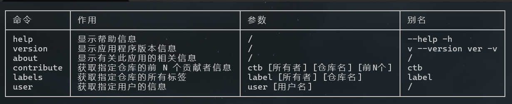
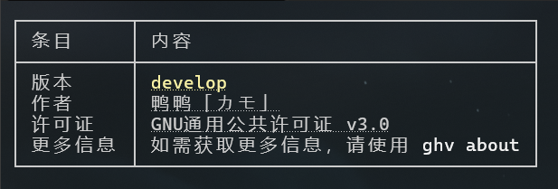
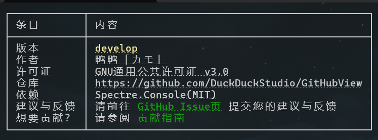
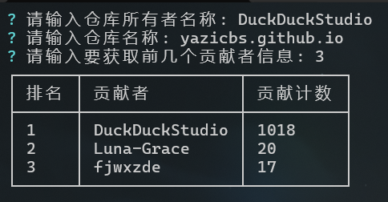
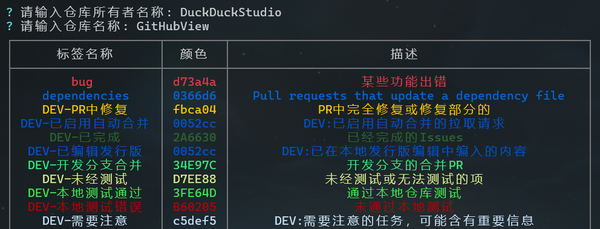

# GitHubView

GitHubView 是一个用于查看 GitHub 上的信息的命令行工具。目前仅支持一些小功能，未来将添加更多功能。

## 可用命令

以下是当前可用的命令列表  

| 命令 | 作用 | 参数 | 别名 |
|-----|-----|-----|-----|
| `help` | 查看帮助 | / | `--help` `-h` |
| `version` | 查看版本信息 | / | `v` `--version` `ver` `-v` |
| `about` | 查看关于此应用的信息 | / | / |
| `contribute` | 获取指定仓库的前 N 个贡献者信息 (贡献者排行榜) | / | `ctb` |
| `labels` | 获取指定仓库的所有标签 | / | `label` |

### 详细介绍
#### help
> 别名: `--help` `-h`  

  
  
显示关于此程序的帮助信息。

#### version
> 别名: `v` `--version` `ver` `-v`  

  
  
显示关于此程序的版本信息。 在部分终端可以点击内容跳转到详细链接。

#### about

  
  
显示关于此程序的详细信息。 在部分终端可以点击内容跳转到详细链接。

#### contribute
> 别名: `ctb`  

  
  
获取指定仓库的前 N 个贡献者信息。 换句话说就是获取仓库的贡献数/者排行榜。 后续可能会加入点击跳转用户界面或筛选提交的功能，敬请期待。

#### labels
> 别名: `label`  

  
  
获取指定仓库的所有标签。 <del>相当于<code><a href="https://github.com/DuckDuckStudio/GitHub-Labels-Manager" target="_blank">glm</a> get</code>的表格版。</del>

## 项目状态
### ⭐星星
  

### 状态

## 许可证
本项目基于 [GNU通用公共许可证 v3.0](LICENSE.txt) 许可证开源。  
